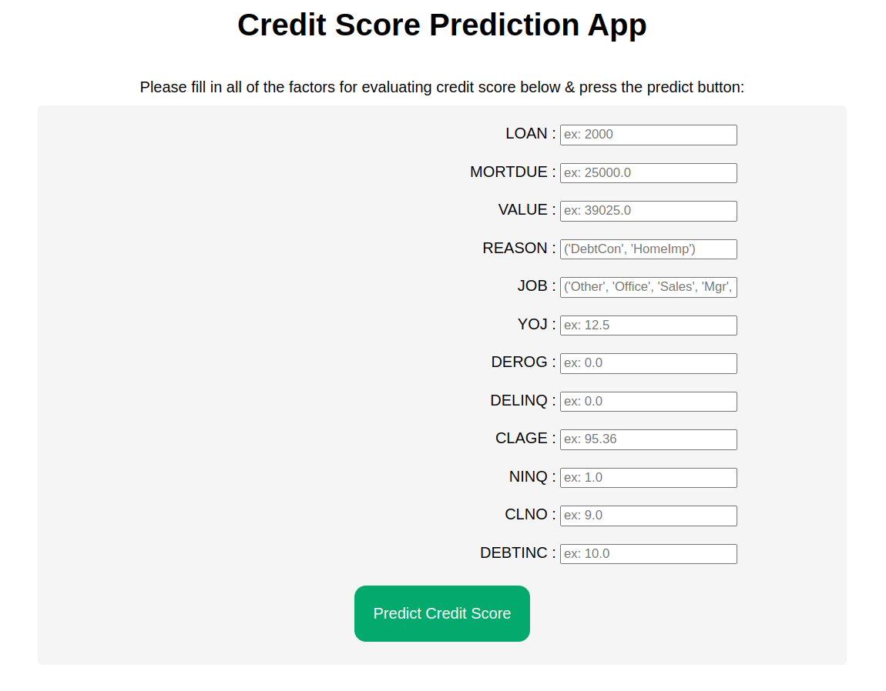
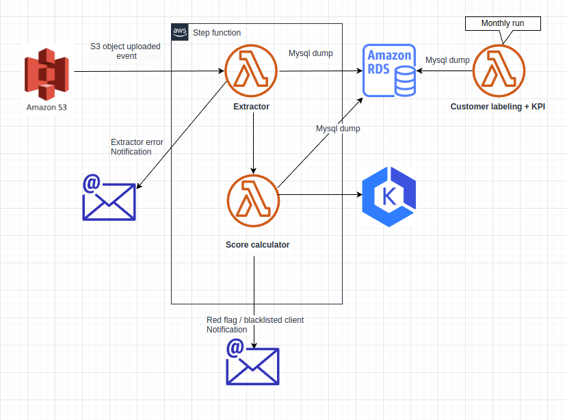

## Deploy Credit scoring model with FastAPI, Docker and Kubernetes 




### I Exploratory Data Analysis and model benchmarking: [My google colab](https://colab.research.google.com/drive/1ST9JZ27cpwSGJm27XJhIbMHVwGR8ocO9#scrollTo=wYv92rEISiWF).
### II Build credit scoring model, add tests and GitHub Action for CI  
 *  Get trained model metric: ```python -m src.train```  (run as a module to import local modules)
```commandline
                   precision recall    f1-score   support
           0       0.96      0.99      0.98       972
           1       0.96      0.82      0.89       220

    accuracy                           0.96      1192
   macro avg       0.96      0.91      0.93      1192
weighted avg       0.96      0.96      0.96      1192
```
 * Predict new data test: ```pytest src/tests/test_predict.py -v -s```
 * Run pytest in docker container
   *  ```docker build -t tests -f deployment/docker/Dockerfile_pytest .```
   *  ```docker run tests```

### III Containerize FastAPI App with Docker
* Run FastAPI in docker container
  *  ```docker build -t sungyichun2046/credit-scoring:latest -f deployment/docker/Dockerfile .```
  *  ```docker run -d --name credit-scoring-container -p 8000:8000 sungyichun2046/credit-scoring:latest```

*  Test predict endpoint without ui
```commandline
$curl -X POST "http://localhost:8000/predict_score_no_ui" -H "Content-Type: application/json" -d '{"loan": 2000, "mortdue": 25000.0, "value": 39025.0, "reason": 1, "yoj": 12.5, "derog": 0.0, "delinq": 0.0, "clage": 95.366666667,"ninq": 1.0, "clno": 9.0, "debtinc": 1.3, "job": 3}'
{"prediction":1,"hostname":"eadad67fd8be","ip_address":"172.17.0.2"}
```
 
### IV AutoScale Docker containers using Kubernetes
* `docker login` and push image `docker push sungyichun2046/credit-scoring:latest` OR pull my docker image `docker pull sungyichun2046/credit-scoring:latest`
* Install minikube and kubectl
* Start minikube: `minikube start — driver=docker`
* Create a Namespace: `kubectl create namespace python-api-namespace`, check it with `kubectl get ns`
* Create a deployment: `kubectl apply -f deployment/kubernetes/deployment.yaml`, check it with `kubectl get pods -n python-api-namespace`
* Create a service : `kubectl apply -f deployment/kubernetes/service.yaml`, check it with `kubectl get service -n python-api-namespace`
* Get Kubernetes URL for service: 
```commandline
$minikube service credit-scoring-service -n python-api-namespace --url
http://192.168.49.2:31230
```
* Check with curl 
```commandline
$curl -X POST "[Kubernetes URL for service]/predict_score_no_ui" -H "Content-Type: application/json" -d '{"loan": 2000, "mortdue": 25000.0, "value": 39025.0, "reason": 1, "yoj": 12.5, "derog": 0.0, "delinq": 0.0, "clage": 95.366666667,"ninq": 1.0, "clno": 9.0, "debtinc": 1.3, "job": 3}'
{"prediction":1,"hostname":"credit-scoring-69cf89d766-wfxth","ip_address":"10.244.0.3"}
```
* Autoscale configuration: `kubectl apply -f deployment/kubernetes/hpa.yaml`, check with `kubectl get hpa -n python-api-namespace`
* Change `kubernetes_url_for_service` with url found before in `autoscaling_test.py`
* Test autoscaling with generated requests: run `python deployment/kubernetes/autoscaling_test.py --cpu-intensive True`
* Result:
 
    * CPU utilization 
      ```commandline
      $ kubectl get hpa -n python-api-namespace
      NAME                 REFERENCE                   TARGETS        MINPODS   MAXPODS   REPLICAS   AGE
      credit-scoring-hpa   Deployment/credit-scoring   cpu: 90%/40%   2         4         2          70m
      ```
    * Pod number: replicas pass from 1 to 4 

      ```commandline
      $ kubectl get pods -n python-api-namespace
      NAME                              READY   STATUS    RESTARTS      AGE
      credit-scoring-69cf89d766-fwfqv   1/1     Running   0             15s
      credit-scoring-69cf89d766-pfncf   1/1     Running   0             15s
      credit-scoring-69cf89d766-vvbpl   1/1     Running   0             2m30s
      credit-scoring-69cf89d766-xz5zs   1/1     Running   0             18m
      ```

### Kubernetes troubleshooting
* Error validating "/etc/kubernetes/addons/storage-provisioner.yaml after `minikube start`
  * Solution: `minikube delete`

* Metrics API not available error OR cpu unknown error after `kubectl get hpa -n python-api-namespace`
  ```commandline
  $ kubectl top pods -n python-api-namespace
  error: Metrics API not available
  ```
    * Solutions:
      * `https://medium.com/@cloudspinx/fix-error-metrics-api-not-available-in-kubernetes-aa10766e1c2f`
      * OR ```kubectl create -f https://raw.githubusercontent.com/pythianarora/total-practice/master/sample-kubernetes-code/metrics-server.yaml```

* See logs of a pod : `kubectl logs [pod_name] -n python-api-namespace`

### Project Tree 
```commandline
├── deployment
│   ├── docker
│   │   ├── Dockerfile
│   │   └── Dockerfile_pytest
│   └── kubernetes
│       ├── autoscaling_test.py
│       ├── deployment.yaml
│       ├── hpa.yaml
│       └── service.yaml
├── README.md
├── requirements.txt
├── src
│   ├── data
│   │   ├── hmeq.csv
│   │   ├── test_df.csv
│   │   └── train_df.csv
│   ├── features_generator.py
│   ├── __init__.py
│   ├── model.py
│   ├── model_trainer.py
│   ├── README.md
│   ├── tests
│   │   ├── __init__.py
│   │   └── test_predict.py
│   ├── trained_models
│   │   └── extraTrees_model.sav
│   │            
│   └── train.py
└── ui
    ├── app.py
    ├── __init__.py
    ├── static
    │   └── css
    │       └── style.css
    └── templates
        ├── index.html
        └── prediction.html
```

### AWS System Design to deploy the project




